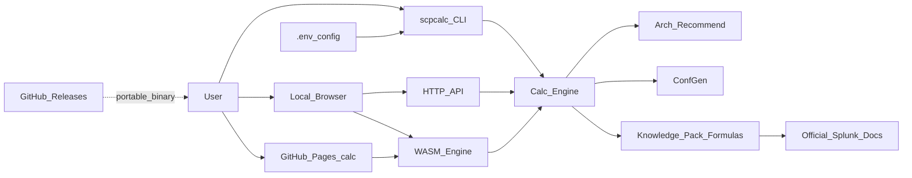
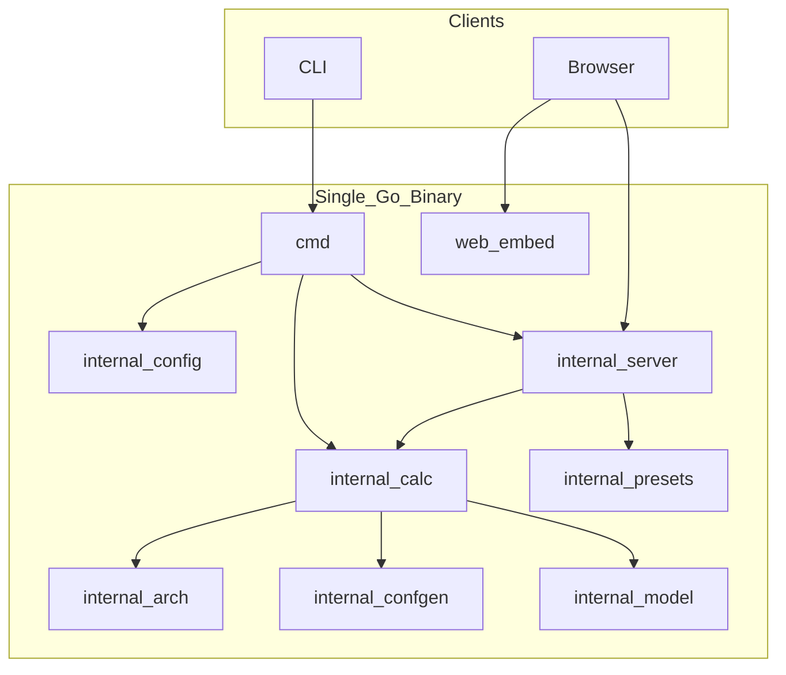

# SCPcalc — High-Level Design (HLD)

## 1. Goals

- Provide a **portable**, **cross-platform**, **open-source** calculator for Splunk capacity / retention planning.
- Expose the same engine via a **simple CLI** and a **local web GUI** (wizard + charts + conf editor).
- Align math with the monorepo knowledge pack (`docs/en/01`–`05`) and official Splunk planning ratios.
- Support **multi-index** plans, **topology** (indexer cluster / SHC / SmartStore), **ES / ITSI** awareness, and draft **`indexes.conf`**.
- Be **GitHub-ready**: clear module layout, MIT license, CI, and binary Releases.
- Configure listen address via **`.env` / env / CLI** (default port **12345**).

## 2. Non-goals

- Connecting to a live Splunk deployment or reading real license/MC data.
- Fully automating every ES / ITSI scale-table cell (KPI counts, detections, multisite RF/SF) — we apply documented **floors / guidelines** and warn when outside tables.
- Full BOM (HF/management farm, app placement, IOPS/latency validation engines) — those remain in the knowledge pack narrative.
- Multi-user auth or internet-facing SaaS deployment.
- Replacing the Markdown knowledge pack (calculator complements it).

What **is** automated from the pack: storage MB fields (incl. per-peer), measured `C`, summary + DMA estimate, SmartStore cache/remote sizing + conf stubs, platform SH/IDX table, ES indexer floors, ITSI `ceil(D/100)`, SHC/CM roles, hardware tier hints.

## 3. Context

## 4. Product surfaces

| Surface | Role |
|---|---|
| CLI `calc` | Full multi-index plan (same `PlanInput` / `PlanResult` as the Web UI) |
| CLI `serve` | Embedded UI + JSON API on configurable host/port |
| Static Pages `/calc/` | Same UI + **Go WASM** engine in the browser (no server; CI builds `.wasm`) |
| Web wizard | Modes: sources / total / capacity; topology; retention; sources |
| Web charts | Volume & retention views (Chart.js, offline embed) |
| Web conf editor | Find/replace, rename volumes/paths, copy/download |
| Hover tips | Formulas + examples + official doc links |

## 5. Runtime architecture

## 6. Planning modes

| Mode | Intent |
|---|---|
| `sources` | User lists log sources with `daily_gb` or EPS×bytes |
| `total` | “If D GB/day arrives” — optional source split scaled to total |
| `capacity` | Disk budgets per hot/cold/summaries → fit + reverse max daily/retention |

## 7. Portability model

- One **static** binary per OS/arch (`scpcalc-v*` Releases).
- No Node/Python runtime required to run the calculator.
- UI assets (HTML/CSS/JS + Chart.js + tips) are **`embed`ded** (no CDN fonts — system font stack).
- Default listen: **`0.0.0.0:12345`** (override with `.env` / flags).

## 8. License

MIT (repository root `LICENSE`).
