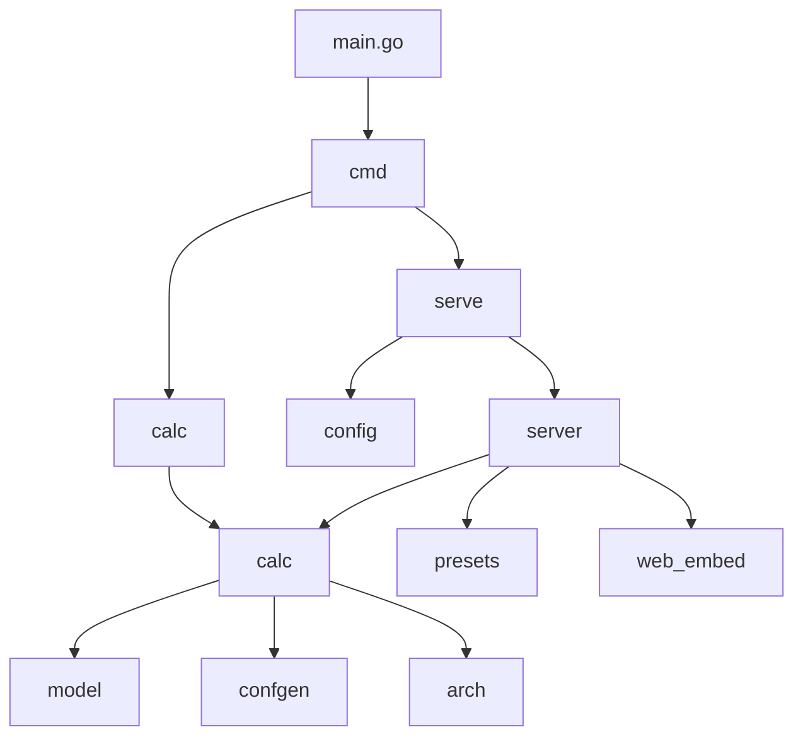

# SCPcalc — Low-Level Design (LLD)

## 1. Repository file map

```text
scpcalc/
├── README.md
├── .env.example          # documented defaults (copy → .env)
├── go.mod
├── main.go
├── Makefile
├── cmd/                  # CLI modules: root, usage, calc*, serve
├── internal/
│   ├── model/            # PlanInput, SourceRow, Design, legacy Input
│   ├── calc/             # Calculate / CalculatePlan
│   ├── arch/             # N_SH/N_IDX + hardware resources + narratives
│   ├── confgen/          # indexes.conf renderer
│   ├── presets/          # default event_bytes catalog
│   ├── config/           # .env + serve address resolution
│   └── server/           # HTTP mux + API
├── web/                  # SPA + Chart.js + tips.js + js/*.js + css/*.css (embedded)
├── scripts/              # live_test / smoke helpers
└── docs/                 # HLD / LLD / Logic / Language
```

## 2. Packages

| Package | Responsibility |
|---|---|
| `main` | Entrypoint → `cmd.Execute` |
| `cmd` | Subcommands; wires config for `serve` |
| `internal/model` | Structs, defaults, validation |
| `internal/calc` | Multi-index sizing, warnings, calls arch + confgen |
| `internal/arch` | Platform table, ES/ITSI floors, layer hardware, design/settings text |
| `internal/confgen` | Volumes + index/summary stanzas |
| `internal/presets` | Built-in log-source event size defaults |
| `internal/config` | Load `.env`; resolve Host/Port/Addr |
| `internal/server` | Health, presets, calculate, plan, static files |
| `web` | Embedded UI assets |



## 3. HTTP API

| Method | Path | Body / notes |
|---|---|---|
| `GET` | `/api/v1/health` | `{status, version}` |
| `GET` | `/api/v1/presets` | `{note, sources[]}` event-byte catalog |
| `POST` | `/api/v1/calculate` | Legacy `model.Input` → `model.Result` |
| `POST` | `/api/v1/plan` | `model.PlanInput` → `model.PlanResult` (+ `design`) |
| `GET` | `/`, `/app.js`, … | Embedded static UI |

### `PlanInput` (primary)

| Field | Notes |
|---|---|
| `mode` | `sources` \| `total` \| `capacity` |
| `sources[]` | `index_name`, `daily_gb` and/or `eps`+`event_bytes`, per-row retention/hot_warm, `enable_summary`, `summary_daily_gb`, … |
| `total_daily_gb` | Used by `total` / `capacity` |
| `available_hot_gb` / `available_cold_gb` | Required (either) for capacity reverse; summaries optional |
| `compression` | `0` = RF/SF or 0.5; `>0` = measured C |
| `indexer_cluster`, `rf`, `sf` | If cluster off → RF=SF=1. If on and unset → 3/2 |
| `search_head_cluster`, `smartstore`, `has_es`, `has_itsi` | Topology / apps |
| `enable_dma`, `dma_pct` | DMA/tstats; default on when ES if unset |
| `archive_frozen`, `frozen_path` | Optional archive (`coldToFrozenDir`) |
| `remote_path` | SmartStore object-store path |
| `concurrent_users`, `n_idx`, `n_sh` | Overrides (0=auto); floors warn; RF/SHC hard-raise |
| paths / retention / headroom / summary_* | Same meanings as knowledge pack |

### `PlanResult`

Cluster-wide totals (raw/on-disk/searchable/summary), per-peer volume budgets MB (+ `*_cluster_mb`), `indexer_peers`, `indexes[]` (MB per peer when N_IDX&gt;1), `indexes_conf`, `design` (incl. `remote_store_gb`, ES/ITSI SH counts, resources), `warnings[]`.

## 4. CLI

### `serve`

```text
--addr HOST:PORT     full listen address (wins)
--host HOST          default from .env / 0.0.0.0
--port PORT          default from .env / 12345
```

Resolution order: **CLI → process env → `.env` → defaults**.

### `calc` (full PlanInput — same engine as Web UI)

```text
--plan FILE | -              full PlanInput JSON (stdin with -)
--sources FILE | -           JSON array of source rows
--mode sources|total|capacity
--total-daily-gb --available-hot-gb --available-cold-gb --available-summaries-gb
--retention-days --hot-warm-days --headroom --summary-pct --summary-retention-days
--hot-path --cold-path --frozen-path --summaries-path --archive-frozen
--compression
--concurrent-users --indexer-cluster --search-head-cluster --rf --sf
--n-idx --n-sh --smartstore --remote-path
--has-es --has-itsi --es-smartstore --enable-dma --no-dma --dma-pct
# legacy single-index convenience:
--daily-gb --eps --event-bytes --index-name
# output:
--json --conf-out FILE --design-out FILE
```

Human output includes node counts (`N_SH` / `N_IDX` + rationale), design/resources/settings narratives, per-index table, and `indexes.conf`. `--json` emits the same `PlanResult` as `POST /api/v1/plan`.

## 5. Configuration keys

| Key | Meaning |
|---|---|
| `SCPCALC_HOST` | Bind host |
| `SCPCALC_PORT` | Bind port (default **12345**) |
| `SCPCALC_ADDR` | Optional `host:port` override |
| `SCPCALC_ENV_FILE` | Alternate path to env file |

See [`.env.example`](../.env.example).

## 6. Error model

- Validation → HTTP 400 `{"error":"..."}` or CLI stderr + exit 1.
- Engine returns `error`; no panic on bad input.
- Missing `.env` is not an error.

## 7. Embedding

`web` package embeds `index.html`, `app.css` (imports `css/*.css`), `app.js`, `tips.js`, `js/*.js` (ES modules), `wasm/scpcalc.wasm` + `wasm_exec.js`, `vendor/chart.umd.min.js`.  
UI prefers **in-browser Go WASM** (`js/engine.js`); falls back to `POST /api/v1/plan` when `serve` API is available.  
Static Pages copy: `make pages-calc` → repo-root [`calc/`](../../calc/).
UI entry is `app.js` (`type="module"`) which imports packages under `web/js/` (`i18n`, `sources`, `plan-form`, `conf-editor`, `charts`, `wizard`, `results`, …).  
`server.NewMux` serves them with `http.FileServer(http.FS(...))`.

## 8. Testing

| Area | Package tests |
|---|---|
| Formulas / plan modes | `internal/calc` |
| Conf stanzas | `internal/confgen` |
| Architecture / resources | `internal/arch` |
| Validation | `internal/model` |
| Presets catalog | `internal/presets` |
| `.env` / addr | `internal/config` |
| HTTP API | `internal/server` |
| Live smoke | `make live-test` / `scripts/` |
