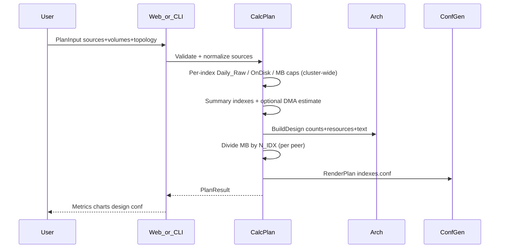

# SCPcalc — Logic and Formulas

Maps to knowledge pack:

- [`docs/en/01-Infrastructure-Sizing.md`](../../docs/en/01-Infrastructure-Sizing.md)
- [`docs/en/02-Storage-Sizing.md`](../../docs/en/02-Storage-Sizing.md)
- [`docs/en/05-Index-Buckets-Retention-and-indexes-conf.md`](../../docs/en/05-Index-Buckets-Retention-and-indexes-conf.md)

Official anchors:

- [Estimate your storage requirements](https://docs.splunk.com/Documentation/Splunk/latest/Capacity/Estimateyourstoragerequirements)
- [Buckets and indexer clusters](https://docs.splunk.com/Documentation/Splunk/latest/Indexer/Bucketsandclusters)
- [Summary of performance recommendations](https://docs.splunk.com/Documentation/Splunk/latest/Capacity/Summaryofperformancerecommendations)
- [SmartStore system requirements](https://docs.splunk.com/Documentation/Splunk/latest/Indexer/SmartStoresystemrequirements)
- [indexes.conf](https://docs.splunk.com/Documentation/Splunk/latest/Admin/Indexesconf)

## 1. Sequence (plan)



## 2. Daily raw volume

**Preferred — license / ingest GB:**

```text
Daily_Raw_GB = daily_gb
```

**Alternate — event rate:**

```text
Daily_Raw_GB = EPS × 86400 × event_bytes / (1024³)
```

If both are set and `daily_gb > 0`, **daily_gb wins**.

**`total_daily_gb`:** if only this is set, synthesize index `main`. If sources exist and total is set, scale source volumes so they sum to total.

## 3. Compression / on-disk factor

```text
If compression > 0:        Comp = compression   # measured C (docs/en/02 §2)
Else if RF=1 and SF=1:     Comp = 0.5
Else:                      Comp = 0.15×RF + 0.35×SF

Daily_OnDisk_GB = Daily_Raw_GB × Comp
Daily_OnDisk_MB = Daily_OnDisk_GB × 1024
```

When `indexer_cluster=false`, engine forces RF=1, SF=1 (even if RF/SF were sent). Enabling cluster (`indexer_cluster=true`) defaults RF=3, SF=2 if unset.

**CLI notes:**
- Legacy flags without `--plan`: `--rf`/`--sf` > 1 imply `--indexer-cluster` (same idea as `Input.ToPlan`).
- With `--plan FILE`, an explicit `"indexer_cluster": false` in JSON is **never** overridden by RF/SF values in that file (API-compatible).

## 4. Retention fields (per index)

```text
Searchable_TB          = Daily_OnDisk_GB × RetentionDays / 1024
maxTotalDataSizeMB     = round(Daily_OnDisk_MB × RetentionDays × Headroom)
homePath.maxDataSizeMB = round(Daily_OnDisk_MB × HotWarmDays × Headroom)
frozenTimePeriodInSecs = RetentionDays × 86400

maxDataSize =
  auto_high_volume  if Daily_Raw_GB ≥ 10
  auto              otherwise
```

Per-source `retention_days` / `hot_warm_days` override globals when set.

### Per peer (docs/en/02 §8, docs/en/05 §6)

After `N_IDX` is chosen, **indexes.conf MB fields and volume caps are divided by `N_IDX`**. Cluster-wide totals remain in `*_cluster_mb` / design need GB.

## 5. Summary indexes

If `enable_summary`:

```text
SummaryDailyRaw = summary_daily_gb  OR  Daily_Raw × summary_pct   (default pct=0.10)
```

Then apply the same Comp / retention formulas with `summary_retention_days`.  
Conf places summary indexes on `volume:summaries`.

## 6. DMA / tstats

When `enable_dma=true` or (unset and `has_es=true`):

```text
DMA_MB ≈ TotalDailyOnDisk_GB × 1024 × RetentionDays × Headroom × dma_pct   (default dma_pct=0.10)
```

- Adds DMA_MB to summaries volume budget  
- Emits `tstatsHomePath` on primary indexes  
- Without DMA/ES, `tstatsHomePath` is omitted  

## 7. Volume budgets

```text
HotBudgetMB   = Σ homePath.maxDataSizeMB   (+ available_hot_gb cap if set)
ColdBudgetMB  = Σ (maxTotal − homePath)    (+ available_cold_gb cap)
SumBudgetMB   = Σ summary maxTotal + DMA   (+ available_summaries_gb cap)
```

Design “need” uses **pre-cap cluster-wide** budgets; conf `maxVolumeDataSizeMB` uses per-peer values after ÷ `N_IDX`.

## 8. Capacity reverse

Requires `available_hot_gb` and/or `available_cold_gb` (summaries alone cannot reverse searchable ingest):

```text
AvailableSearchable = available_hot_gb + available_cold_gb
MaxDailyGB ≈ AvailableSearchable / (Comp × RetentionDays × Headroom)
MaxRetentionDays ≈ AvailableSearchable / (Daily_OnDisk)     # if ingest known
```

## 9. Architecture counts (guideline)

- Base `N_SH` / `N_IDX` from Performance Recommendations (users × daily GB); table clamps at ≤3 TB/day and ≤48 users with a warning when exceeded.
- ES floors from doc 01 §6.4 (300→3, 1TB→10, &lt;15TB→24, 15TB→150, &gt;15TB→300 single-SH or 240 SHC).
- ITSI: `N_IDX ≥ ceil(D/100)` (KPI tables not automated — HLD non-goal).
- Indexer cluster: peers ≥ RF; add cluster manager.
- SHC: deployer + N_SH ≥ 3.
- `n_idx` / `n_sh` &gt; 0: use override; warn if below recommended floor; RF / SHC minima still hard-raise.
- ES+ITSI: separate SH tiers (`n_sh_es` + `n_sh_itsi`); resources list both.
- SmartStore: local cache `0.5 × D × (30|90 if ES)`; remote `Remote_Store_GB ≈ D × R × Comp`.

Hardware tiers per role: Reference hardware minimum / mid / high (and ES floors). See `internal/arch`.

**CPU (official):**
- Sizing basis = **physical cores** (`cpu_cores` / `cpu_physical_cores`).
- With hyper-threading, assign **logical/vCPU = 2× physical** (`vcpu` / `cpu_logical_vcpu`) — matches Reference hardware and ES (16 physical / 32 vCPU).
- Virtualization: **reserve** full CPU/RAM; **do not oversubscribe** the hypervisor (`virt_cpu_rule`).
- Splunk pipeline / index parallelization: only when spare CPU above the role minimum (`splunk_parallelization`) — not the same as hypervisor oversubscription.
- Pack docs: `docs/en/01-Infrastructure-Sizing.md` §3.8–3.9.

## 10. Warnings

- `hot_warm_days > retention_days`
- `summaries_path` equals `cold_path`
- ES + SmartStore → 90-day cache advisory
- ES + ITSI → must not share the same SH/SHC
- SHC + indexer cluster → higher search load on indexers
- Available disk smaller than calculated need
- Duplicate sanitized index stanza names (rejected)
- Platform / ES table overflow
- `n_idx` / `n_sh` below recommended floor

## 11. Worked example (doc 05 style)

Retention 60d, hot/warm 30d, headroom 1.0, RF=SF=1:

- Target `maxTotalDataSizeMB ≈ 3443200` ⇒ `Daily_OnDisk_MB ≈ 3443200/60`
- ⇒ `Daily_Raw_GB ≈ 112.08` at Comp=0.5  

Unit test `TestDoc05ReverseExample` locks this within rounding tolerance.

## 12. indexes.conf draft

Emits:

- `[volume:hotwarm|cold]` (+ `[volume:summaries]` when summaries/DMA needed) with path + `maxVolumeDataSizeMB`
- Per index: `homePath` / `coldPath` / `thawedPath` / size+age
- `coldToFrozenDir` **only if** `archive_frozen=true` (default delete)
- `tstatsHomePath` **only if** DMA/ES enabled
- Optional `*_summary` stanzas on summaries volume
- SmartStore: `[volume:remote]` + `remotePath` when `smartstore=true`
